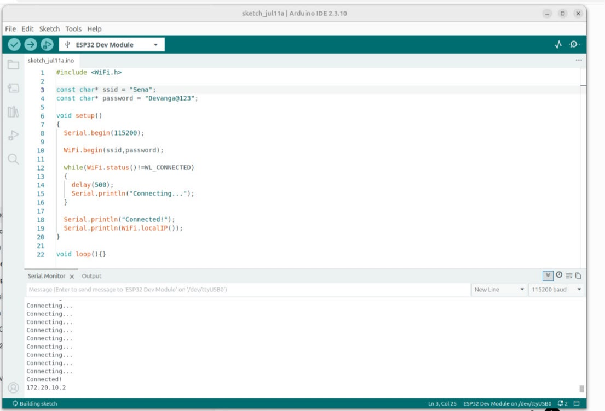
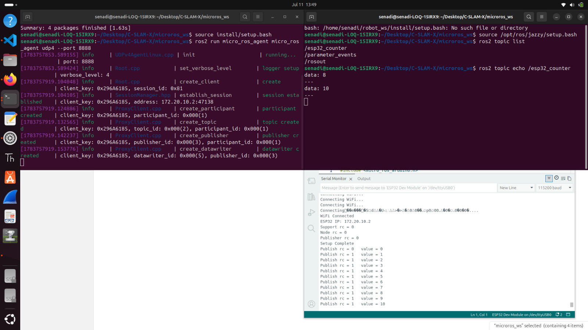

# Week 1

## Completed Tasks

- Created the GitHub repository for the project.
- Created a detailed implementation plan with a Gantt chart to define the project timeline.
- Designed the initial system architecture 
- Ordered and gathered the required hardware components needed to build the two individual robots.
- Since the hardware setup is still in progress, implemented a demo micro-ROS communication test between the laptop and the ESP32 to verify the communication pipeline.

---

## Learnings

### Micro-ROS Communication Between ESP32 and Laptop

The communication between the ESP32 and the laptop was successfully tested using **micro-ROS over WiFi UDP transport**.

Since the ESP32 is a resource constrained embedded device, it works as the **micro-ROS client**, while the laptop runs the **micro-ROS agent**. The communication between the client and agent is handled using the **DDS-XRCE protocol**, which is designed for communication with resource limited devices.

The following steps were completed:

1. Installed and configured the micro-ROS library for Arduino on the ESP32.
2. Verified that the ESP32 was able to successfully connect to the WiFi network.
3. Created a micro-ROS workspace on the Ubuntu laptop.
4. Cloned and built the required micro-ROS packages.
5. Checked the laptop IP address and ensured that both the ESP32 and laptop were connected to the same WiFi network.
6. Started the micro-ROS agent on the laptop using the UDP transport.
7. Uploaded the required micro-ROS client code to the ESP32.
8. Established communication between the ESP32 and the laptop.
9. Verified that the ROS 2 topics and nodes were successfully created and detected from the laptop side.

The successful communication test confirms that once the complete robot hardware setup is finished, the ESP32 can be used to publish sensor data such as:

- IMU measurements
- LiDAR data (through the main processing unit)
- Encoder readings

and receive control commands such as:

- `/cmd_vel` velocity commands from ROS 2 navigation stack

through the same communication architecture.

The screenshots of the successful communication test are attached below:

---

## Next Week Plan

### Hardware Implementation

- Start assembling the robot chassis and mounting the required hardware components.

### Software Implementation

- Continue developing the software architecture for each robot.
- Configure the robot localization package by tuning the parameters according to the available sensors:
  - IMU
  - Wheel encoders
  - LiDAR

- Develop custom ROS 2 nodes required for sensor interfacing.
- Integrate sensor data publishing from the ESP32.
- Begin testing SLAM functionality for each robot individually.