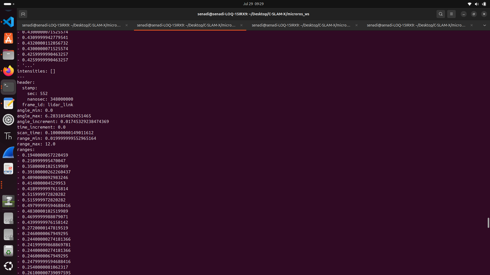

# Week 3

## Completed Tasks
- Calibrated the IMU using the FastIMU library  
- Started working on completing a single functioning robot 
- Changed the message type of the encoder readings to an already existing package since custom messages aren't supported in arduino 
- Change in the architeccture - Without sending the raw data to the pi from the esp32 get the readings and decode it at the esp itself and publish the scan topic using micro ros to the pi 
- Controlled a single robot using teleop but the because of the loose connections ,Implementing the whole pipeline was not possible (Connecting the lidar's scan topic to slam and then autonomous navigation using Nav2)
- Connected the lidar to ESP32 using UART and checked the reading the serial monitor as well as a topic after publishing it using micro ros and view the scan from rviz 

The screenshots of the tasks done are attached below:

 
 
 

## Learnings 
- If the wi-fi is down or the connection Between the esp32 and pi are down explored the idea of a state machine as follows 
  - Normal mode - When connected with pi 
  - Local_exploration mode - Try to reach the last given goal if it cannot be reached explore using the follow the gap algorithm (To be studied more )
  - Sync mode - When it reconencts and gives the explored data 

## Partialy completed tasks - To be completed next week 

- Do the full setup for the two robots and generate the maps and test the full pipeline (Base scenario - normal mode)
